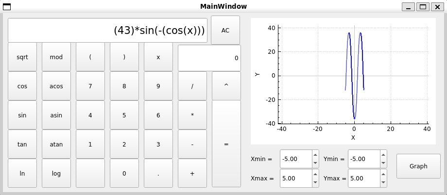

# Калькулятор в QT

Приложение позволяющее вычислять арифметические выражения, строить графики функций.

## Сборка 

Чтобы собрать приложение, выполните следующую команду:

```
make
```

## Использование 

На вход подается выражение, которое необходимо расчитать. По этому выражению можно построить график, если в нём присутствует 'X' или можно вычислить.

<div align="center">
	
</div>